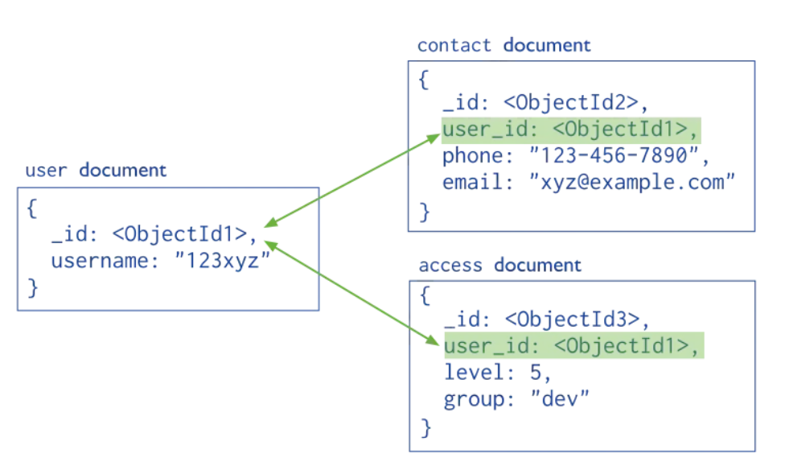

# UnaHur - Red Anti-Social

Se solicita el modelado y desarrollo de un sistema backend para una red social llamada **“UnaHur Anti-Social Net”**, inspirada en plataformas populares que permiten a los usuarios realizar publicaciones y recibir comentarios sobre las mismas.

# Contexto del Proyecto

En una primera reunión con los sponsors del proyecto, se definieron los siguientes requerimientos para el desarrollo de un **MVP (Producto Mínimo Viable)**:

- El sistema debe permitir que un usuario registrado realice una publicación (post), incluyendo **obligatoriamente una descripción**. De forma opcional, se podrán asociar **una o más imágenes** a dicha publicación.

- Las publicaciones pueden recibir **comentarios** por parte de otros usuarios.

- Las publicaciones pueden estar asociadas a **etiquetas (tags)**. Una misma etiqueta puede estar vinculada a múltiples publicaciones.

- Es importante que los **comentarios más antiguos que X meses** (valor configurable mediante variables de entorno, por ejemplo, 6 meses) **no se muestren** en la visualización de los posteos.

####

# Entidades y Reglas de Negocio

Los sponsors definieron los siguientes nombres y descripciones para las entidades:

- **User**: Representa a los usuarios registrados en el sistema. El campo `nickName` debe ser **único** y funcionará como identificador principal del usuario.

- **Post**: Publicación realizada por un usuario en una fecha determinada que contiene el texto que desea publicar. Puede tener **cero o más imágenes** asociadas. Debe contemplarse la posibilidad de **agregar o eliminar imágenes** posteriormente.

- **Post_Images**: Entidad que registra las imágenes asociadas a los posts. Para el MVP, solo se requiere almacenar la **URL de la imagen alojada**.

- **Comment**: Comentario que un usuario puede realizar sobre una publicación. Incluye la fecha en la que fue realizado y una indicación de si está **visible o no**, dependiendo de la configuración (X meses).

- **Tag**: Etiqueta que puede ser asignada a un post. Una etiqueta puede estar asociada a **muchos posts**, y un post puede tener **múltiples etiquetas**.

# Requerimientos Técnicos

1. **Modelado de Datos**

   - Diseñar el modelo documental que represtente todas las entidades definidas por los sponsor del proyecto. Queda a su criterio si usan relaciones embebidas o relaciones referenciadas a otros documentos.

### Ejemplo referenciadas

2. **Desarrollo del Backend**

   - Crear los **endpoints CRUD** necesarios para cada entidad.

   - Implementar las rutas necesarias para gestionar las relaciones entre entidades (por ejemplo: asociar imágenes a un post, etiquetas a una publicación, etc.).

   - Desarrollar las validaciones necesarias para asegurar la integridad de los datos (schemas, validaciones de integridad referencial).

   - Desarrollar las funciones controladoras con una única responsabiliad evitando realizar comprobaciones innecesarias en esta parte del código.

3. **Configuración y Portabilidad**

   - El sistema debe poder cambiar de **base de datos** de forma transparente, utilizando configuración e instalación de dependencias adecuadas.

   - El sistema debe permitir configurar el **puerto de ejecución y variables de entorno** fácilmente.

4. **Documentación**

   - Generar la documentación de la API utilizando **Swagger (formato YAML)**, incluyendo todos los endpoints definidos.

5. **Colecciones de Prueba**

   - Entregar las colecciones necesarias para realizar pruebas (por ejemplo, colecciones de Postman o archivos JSON de ejemplo).

###

# Recomendaciones y ayudas

Les entregamos este link que apunta a un front-end ya desarrollado para que puedan investigarlo y puedan crear el back-end que se ajuste lo maximo posiblel funcionamiento del front.

[https://unahur.vmdigitai.com/redes-front/users](https://unahur.vmdigitai.com/redes-front/users)

Por otro lado les dejamos la documentació de los endpoint para que también la puedan revisar y armar siguiendo este link

[https://unahur.vmdigitai.com/swagger/](https://unahur.vmdigitai.com/swagger/)

# Bonus

- Hace el upload de las imganes que se asocian a un POST que lo guarden en una carpeta de imagenes dentro del servidor web.
- ¿Cómo modelarías que un usuario pueda "seguir" a otros usuarios, y a su vez ser seguido por muchos? Followers
- Con la información de los post no varia muy seguido que estrategias podrian utilizar la que la información no sea constantemente consultada desde la base de datos.
